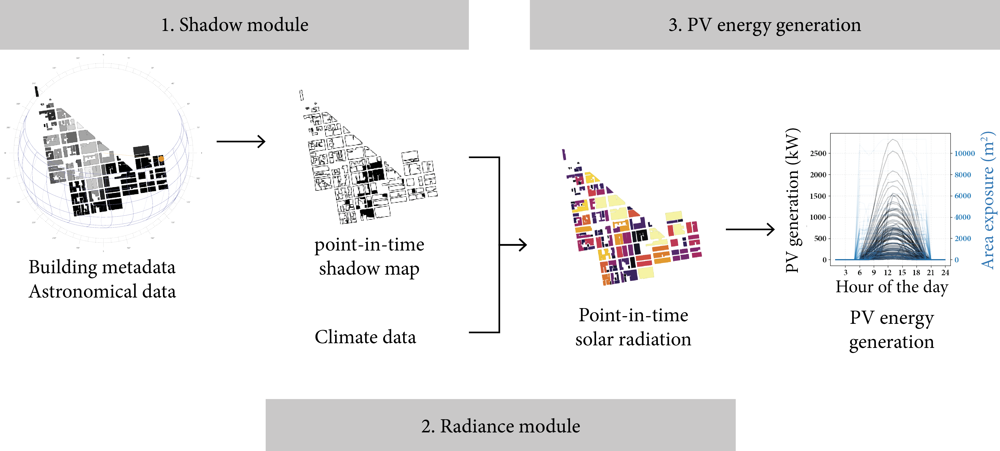

# Building Shade Calculator

A Python tool for calculating shading patterns on buildings by analyzing building footprints and solar positions.


## Features

- Multi-building shadow analysis
- Self-shading and neighboring building shadows calculation
- Support for different times of day and seasons
- JSON format output with detailed metrics
- Complex building geometry handling

## Prerequisites

Required Python packages:
```bash
numpy
pandas
geopandas
shapely
tqdm
```

## Input Data Format

### Building Data (CSV)
| Column | Description | Type |
|--------|-------------|------|
| geometry | Building footprint | WKT format |
| coordinates | Vertex coordinates | Array [[x1,y1], [x2,y2], ...] |
| elevation_m | Ground elevation | Float (meters) |
| Height | Building height | Float (meters) |

Example:
```csv
geometry,coordinates,elevation_m,Height
POLYGON((x1 y1, x2 y2,...)),[[x1,y1],[x2,y2],...],10.5,25.0
```

### Solar Position Data (CSV)
| Column | Description | Type |
|--------|-------------|------|
| Solar_Azimuth | Solar azimuth angle | Float (degrees) |
| Solar_Elevation | Solar elevation angle | Float (degrees) |
| solar_pos_x | Sun vector X component | Float |
| solar_pos_y | Sun vector Y component | Float |
| solar_pos_z | Sun vector Z component | Float |

Example:
```csv
Solar_Azimuth,Solar_Elevation,solar_pos_x,solar_pos_y,solar_pos_z
180,45,-0.707,0.0,-0.707
```

## Troubleshooting

### Invalid Building Geometry
- Ensure building coordinates form closed polygons
- Check for self-intersecting geometries
- Verify coordinate system consistency

### Solar Position Errors
- Confirm solar angles are in degrees
- Verify sun vector components are normalized
- Check for negative elevation angles

### Performance Issues
- Large datasets may require batch processing
- Consider reducing temporal resolution for initial tests
- Verify available system memory

## Contributing

Contributions are welcome! Please feel free to submit a Pull Request.

## Citation
Zhuang X., Lvy G., Zhao Z. and Caldas L., Rapid Solar Potential Assessment for Complex Urban Morphologies: a Vector-Based Approach.

## License

This project is licensed under the MIT License - see the LICENSE file for details.
